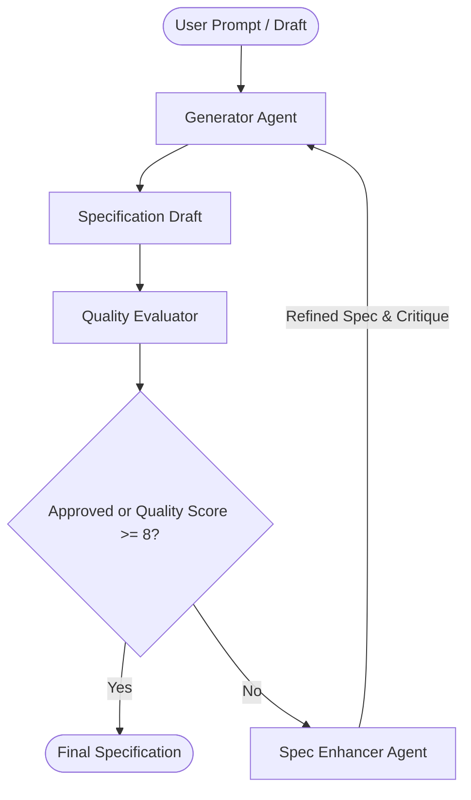

# Spec Deliberator Agent (with Google ADK)

A sequential, multi-agent refinement loop system built on top of the **Agent Development Kit (ADK)** and designed to run strictly under the **`uv`** package manager. 

This system automates the process of transforming raw ideas or incomplete draft requirements into complete, production-ready development specifications.

## 🔄 Multi-Agent Loop Architecture

The system implements the sequential feedback and refinement workflow detailed in the diagram below:



### The Three Core ADK Agents:

1. **Generator Agent** (`generator_agent`): 
   Generates or rewrites the full specification document from the original prompt or updated feedback.
2. **Quality Evaluator Agent** (`quality_evaluator`): 
   Audits the specification using Pydantic structured schema outputs (`EvaluationResult`). It returns a checklist approval state (`approved`), a quality score (1-10), and a structured list of actionable critiques and gap items.
3. **Spec Enhancer Agent** (`spec_enhancer`): 
   Combines Product Management and QA Engineer roles. It reads the previous draft and the Evaluator's critique to enrich the document with goals, concrete implementation tasks (IDs, titles, dependencies, success criteria), and comprehensive test cases.

---

## 🛠️ Installation & Setup

Ensure you have `uv` installed. If not, follow instructions at [astral.sh/uv](https://astral.sh/uv).

To set up the environment and install dependencies:

```bash
# Initialize venv and install dependencies
uv venv
uv pip install -r requirements.txt --index-url https://pypi.org/simple
```

---

## 🚀 Running the Refinement Loop

Run the deliberator system using `uv run python run.py` and supply a raw markdown file as the input:

```bash
uv run python run.py drafts/raw_spec.md --output specs/final_spec.md --max-rounds 3
```

### CLI Arguments:
* `input`: Path to raw spec draft or user prompt file (Required).
* `-o`, `--output`: Path to write the finalized spec (Default: `specs/refined_spec.md`).
* `-r`, `--max-rounds`: Maximum number of refinement loop rounds (Default: `3`).

---

## 📋 Features

* **Real-time Streaming Thoughts**: Shows streaming text and thoughts from each agent directly in the terminal as they compute and iterate.
* **Hermetic & Structured Execution**: Uses standard ADK `InMemoryRunner`, `InMemorySessionService`, `InMemoryMemoryService`, and `InMemoryArtifactService` to cleanly isolate model runs.
* **Robust Verification**: Automatically logs structured quality scoring metrics, feedback, and approvals per round.
