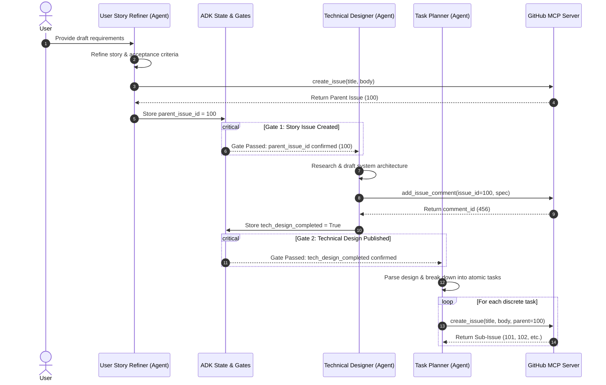

# Spec Deliberator Agent (with Google ADK)

A sequential, multi-agent refinement loop system built on top of the **Agent Development Kit (ADK)** and designed to run strictly under the **`uv`** package manager.

This system automates the process of transforming raw ideas or incomplete draft requirements into complete, production-ready development specifications.

## 🔄 Multi-Agent Loop Architecture

The system implements the sequential feedback and refinement workflow detailed in the diagram below:



### The Three Core ADK Agents:

1. **User Story Refiner Agent** (`story_refiner`):
   A Product Manager persona that refines draft requirements into a professional user story and detailed acceptance criteria, and simulates creating a Parent Issue on GitHub.
2. **Technical Designer Agent** (`tech_designer`):
   A Software Architect persona that drafts the system architecture, schemas, and API contracts based on the story, and attaches it as a comment to the Parent Issue.
3. **Task Planner Agent** (`task_planner`):
   An Engineering Lead persona that analyzes the system specification and breaks it down into structured, implementable developer tasks.

Additionally, the workflow includes a **Parallel Sub-Issue Worker** (`create_sub_issues_worker`) that concurrently loops through and creates nested sub-issues under the parent issue using ADK's native parallel node processing capabilities (`@node(parallel_worker=True)`).

---

## 🛠️ Installation & Setup

Ensure you have `uv` installed. If not, follow instructions at [astral.sh/uv](https://astral.sh/uv).

To set up the environment and install dependencies:

```bash
# Initialize venv and install dependencies
uv venv
uv pip install -r requirements.txt --index-url https://pypi.org/simple
```

---

## 🚀 Running the Workflow

Run the graph workflow system using `uv run python run.py` and supply a raw requirements draft as the input:

```bash
uv run python run.py drafts/raw_spec.md --output specs/refined_spec.md
```

### CLI Arguments:
* `input`: Path to raw spec draft or user prompt file (Required).
* `-o`, `--output`: Path to write the finalized spec (Default: `specs/refined_spec.md`).
* `-r`, `--max-rounds`: Maximum number of rounds (Ignored in workflow mode, kept for backward compatibility).

---

## 📋 Features

* **Sequential Graph Orchestration**: Uses standard ADK 2.0 `Workflow`, `START`, and `Edge` declarations to direct the multi-agent execution pipeline.
* **State Checkpoints & Gates**: Uses ADK's native context state matching within dedicated gate nodes to verify parent issue creation and technical specification publishing checkpoints.
* **Concurrent Sub-Issue Creation**: Processes the task list concurrently using parallel node execution via `@node(parallel_worker=True)` for mock GitHub issue creation.
* **Hermetic & Structured Execution**: Employs standard ADK session state mapping, memory, and artifact services to isolate individual executions.
* **Unified Specification Assembly**: Compiles and outputs a comprehensive system architecture document, user story, and complete task checklist directly into the output target.

