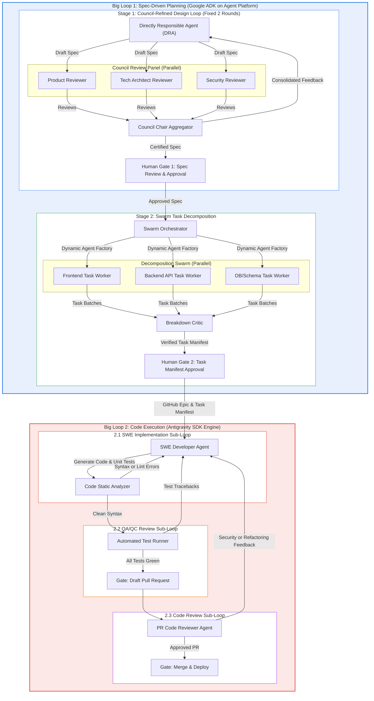

# Agent Factory Architecture: Dual-Loop Multi-Agent System

This document outlines the architecture for **Agent Factory**, a multi-agent platform designed to transform high-level feature requests into production-grade software through two primary execution loops: **Spec-Driven Planning (Google ADK)** and **Code Execution (Antigravity SDK)**.

---

## 🏗️ Core Architecture Overview

The system consists of **2 Big Loops** containing **6 Sub-Loops** total, with clear human-in-the-loop approval gates between phases.

---

## 🏛️ Big Loop 1: Spec-Driven Planning (Google ADK)

Hosted on **Gemini Enterprise Agent Platform / Cloud Run**, Big Loop 1 uses the **Google Agent Development Kit (ADK 2.0)** to deliberate, refine, and decompose software specs.

### 1. Council Review Panel (Product + Tech + Security)
* **Directly Responsible Agent (DRA)**: Takes raw user prompts or issue descriptions and drafts a unified specification document (User Story + BDD scenarios + Technical Architecture + API Contracts + Security NFRs).
* **Council Review Panel**: Concurrently evaluates the draft across three distinct personas:
  1. **Product Reviewer**: Evaluates INVEST criteria, business goals, and user value.
  2. **Tech Architect Reviewer**: Evaluates API completeness, data model integrity, and system complexity.
  3. **Security Reviewer**: Evaluates testability, OWASP vulnerability risks, and error resilience.
* **Council Chair Aggregator**: Merges all three review streams into a single, actionable list of revision instructions for the DRA.
* **Fixed Round Limit**: Enforces a strict 2-round cap to guarantee convergence and fast response times.

### 2. Swarm Task Decomposition
* **Swarm Orchestrator**: Inspects the Council-certified specification and identifies independent subsystems (e.g. Frontend UI, Backend API, Database Migrations).
* **Dynamic Agent Factory**: Instantiates specialized `LlmAgent` instances on the fly using ADK 2.0.
* **Parallel Task Workers**: The swarm workers break down each subsystem into atomic tasks with independent acceptance criteria concurrently.
* **Breakdown Critic**: Validates that all tasks form a valid Directed Acyclic Graph (DAG) without circular dependencies or missing requirements.

---

## 💻 Big Loop 2: Code Execution (Antigravity SDK Engine)

Big Loop 2 runs in local workspace / execution environments using the **Antigravity SDK**, taking the atomic tasks produced in Big Loop 1 and implementing them through three sub-loops:

1. **2.1 SWE Implementation Loop**: Developer agent writes functional code and unit tests.
2. **2.2 QA/QC Review Loop**: Automated test runner executes pytest/jest/build commands. Any tracebacks or failures are fed directly back into the developer agent until all tests pass cleanly.
3. **2.3 Code Review Loop**: PR Critic performs automated code review, security scanning, and architectural sanity checks before approving the Pull Request.

---

## 📚 Related Documentation
* [Human-in-the-Loop (HITL) Multi-Surface Guide](HUMAN_IN_THE_LOOP.md)
* [ADK Planning Engine Implementation Guide](PLANNING_ENGINE_GUIDE.md)
