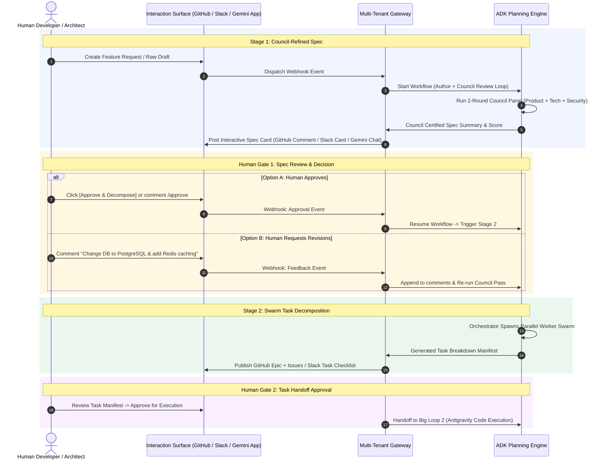

# Human-in-the-Loop (HITL) Multi-Surface Architecture

This document details how human developers and stakeholders interact with the **Spec-Driven Planning Engine (Big Loop 1)** across multiple surfaces (**GitHub**, **Slack**, and **Gemini Enterprise App**).

---

## 🌐 Multi-Surface HITL Interaction Flow

The system acts as a multi-surface proxy. State transitions pause at **Human Approval Gates**, publishing structured summaries to whichever communication channel the team uses, and resuming execution when a human responds.



---

## 📱 Multi-Surface Adapter Breakdown

```
                         ┌──────────────────────────────────────────────┐
                         │           Multi-Tenant Gateway               │
                         │          (`gateway/app/adapters`)            │
                         └──────┬──────────────────┬──────────────┬─────┘
                                │                  │              │
                                ▼                  ▼              ▼
                     ┌──────────────────┐ ┌────────────────┐ ┌─────────────────────────┐
                     │  GitHub Adapter  │ │ Slack Adapter  │ │ Gemini Enterprise App   │
                     └─────────┬────────┘ └───────┬────────┘ └────────────┬────────────┘
                               │                  │                       │
                               ▼                  ▼                       ▼
                     • Issue Description  • Block Kit Cards       • Native ADK Chat       
                     • Thread Comments    • [Approve] Buttons     • Interactive Canvas    
                     • Slash Commands     • Slack Threads         • A2A Protocol          
```

### 1. GitHub Surface (`/webhooks/github`)
* **Output**: The agent posts a rich Markdown comment on the target GitHub Issue containing:
  * Executive Summary & BDD User Stories
  * Tech Architecture & API Contracts
  * Council Quality Scores (e.g. Product: 90%, Tech: 88%, Security: 95%)
* **Input**: Developers approve by typing `/approve` or commenting directly on the issue thread.

### 2. Slack Surface (`/webhooks/slack`)
* **Output**: Posts an interactive Slack **Block Kit Card** in `#engineering-specs` with collapsible sections for Tech Spec, Council Scores, and action buttons (`[Approve & Spawn Swarm]`, `[Request Revision]`).
* **Input**: Clicking buttons or replying in the Slack thread sends interactive payload webhooks to the Gateway.

### 3. Gemini Enterprise App Surface (`/a2a` & Chat UI)
* **Output**: Renders an interactive multi-agent chat session inside the Gemini Enterprise workspace.
* **Input**: Developers can chat directly with the **Council Chair Agent** to ask clarifying questions (e.g. *"Why did the Security Critic flag the JWT token expiration?"*) before approving.

---

## ⚙️ ADK Session Pause & Resume Pattern

In ADK, pausing for human input is managed through **Session State persistence** (`ctx.state`):

```python
from google.adk import Event
from google.adk.events.event_actions import EventActions

async def human_spec_approval_gate(node_input: str, ctx: Context) -> Event:
    """Pauses the ADK workflow and notifies external surfaces for human approval."""
    
    # Check if human approval was already received via webhook
    if ctx.state.get("human_spec_approved") is True:
        print("[Gate] Human approval confirmed! Proceeding to Swarm Decomposition...")
        return Event(actions=EventActions(route="proceed_to_swarm"))
    
    # Otherwise, publish summary to multi-surface gateway and pause workflow
    summary_card = format_multi_surface_card(ctx.state["specifications"])
    await notify_gateway_surfaces(summary_card, ctx=ctx)
    
    # Mark state as awaiting human input
    return Event(
        output="Awaiting human approval on GitHub/Slack/Gemini Enterprise.",
        actions=EventActions(
            state_delta={"workflow_status": "AWAITING_HUMAN_APPROVAL"},
            route="pause_for_human"
        )
    )
```

When a human replies on **any surface**, the Gateway calls the ADK engine endpoint with `state_delta={"human_spec_approved": True, "comments": ["Looks great!"]}`, resuming execution seamlessly.
